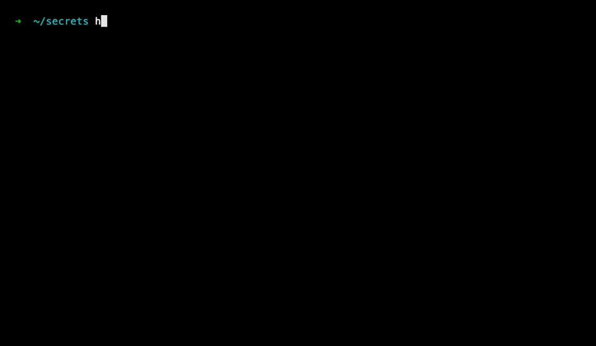
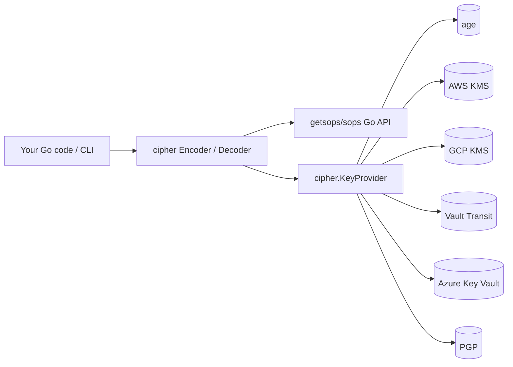

# cipher

[](https://github.com/dcadolph/cipher/actions/workflows/test.yml)
[](https://github.com/dcadolph/cipher/actions/workflows/lint.yml)
[](https://codecov.io/gh/dcadolph/cipher)
[](https://pkg.go.dev/github.com/dcadolph/cipher)
[](https://goreportcard.com/report/github.com/dcadolph/cipher)
[](LICENSE)

Programmatic [SOPS](https://github.com/getsops/sops), from Go. One library and one CLI for encrypt, decrypt, rotate, walk, edit, and audit. Drop in next to your existing sops files and keep going.



Every release is exercised end to end against real Vault Transit, AWS KMS through LocalStack, and a fresh PGP keyring. The on disk format is the standard sops format, so the upstream sops binary reads what cipher writes.

## What you can do

- Encrypt and decrypt YAML, JSON, ENV, INI, or binary files with age, AWS KMS, GCP KMS, Vault Transit, Azure Key Vault, or PGP.
- Edit encrypted files in `$EDITOR`, re-encrypted on save with the original recipients.
- Rotate the per-file encryption key on demand or on age (`--older-than 90d`).
- Add or drop recipients without re-encrypting the payload.
- Walk a directory tree in parallel and apply any of the above to every matching file.
- Route per-path recipient selection from a [`.sops.yaml`](https://github.com/getsops/sops) policy file.
- Block plaintext commits with a git pre-commit hook.
- Stream secrets through Go [`net/http`](https://pkg.go.dev/net/http) middleware and emit [OpenTelemetry](https://opentelemetry.io) traces.

## When to pick cipher

| Tool | Best for | Tradeoff |
|------|----------|----------|
| **cipher** | Secrets committed to git plus Go integration, parallel directory walks, audit and drift checks, and a pre-commit hook. | Pre-1.0. Go API may break between minor versions. |
| raw `sops` CLI | Secrets in git when one file at a time is enough and no Go consumer needs an encrypt API. | No directory walker. The sops Go API only decrypts. |
| HashiCorp Vault | Runtime secrets your app fetches over the network on each request. | Server to run and maintain. |
| AWS Secrets Manager | AWS native runtime secrets resolved by IAM. | AWS lock in. Runtime only. |
| Azure Key Vault | Azure native runtime secrets. | Azure lock in. Runtime only. |

Pick cipher when the secrets live in your repo and you want one tool that behaves the same way from Go code, from CI, and from your editor. Pick Vault or one of the managed runtime stores when the secrets live in a server and the app fetches them at runtime.

## Quickstart

### CLI

```sh
brew install dcadolph/tap/cipher
```

```sh
age-keygen -o key.txt
export SOPS_AGE_KEY_FILE=$PWD/key.txt
PUB=$(age-keygen -y key.txt)

echo "db_password: super-secret" > prod.yaml
cipher encrypt --age "$PUB" -i prod.yaml
cipher decrypt prod.yaml
```

See [`cmd/README.md`](cmd/README.md) for every verb and flag.

### Library

```go
import (
    "github.com/dcadolph/cipher"
    "github.com/dcadolph/cipher/age"
)

id, _ := age.GenerateIdentity()
kp, _ := age.NewProvider(id.Recipient)

enc := cipher.NewEncoder(kp)
ciphertext, _ := enc.Encode(ctx, "secrets.yaml", []byte("foo: bar\n"))

dec := cipher.NewDecoder()
plain, _ := dec.Decode(ctx, "secrets.yaml", ciphertext)
```

Full API reference at [godoc](https://pkg.go.dev/github.com/dcadolph/cipher). Runnable per-backend programs live under [`examples/`](examples/).

## Recipes

### Encrypt every plaintext file that matches `.sops.yaml`

```sh
cipher fix ./secrets
```

Walks the tree, finds plaintext files that match a creation rule, and encrypts them in place with the recipients the rule names.

### Edit a secret in your text editor

```sh
cipher edit secrets.yaml
```

Decrypts to a `0600` file in a fresh `0700` temp directory, opens `$EDITOR`, re-encrypts on save with the original recipients. Plaintext never lands on a shared path.

### Add a teammate to an existing file

```sh
cipher add-recipient secrets.yaml --age age1bob... -i
```

The wrapped data key picks up Bob. The encrypted payload itself does not change.

### Rotate the data key on every file older than 90 days

```sh
cipher walk rotate ./secrets --config .sops.yaml --older-than 90d --parallel 8
```

Same recipient set, fresh AES key, payload re-encrypted under it. Files newer than the cutoff are skipped.

### Audit who can decrypt what

```sh
cipher recipients list secrets.yaml --pretty
cipher recipients drift ./secrets --config .sops.yaml
```

`list` prints the recipients recorded in a file. `drift` reports files whose recipient set no longer matches `.sops.yaml`.

### Block plaintext commits

```sh
cat > .git/hooks/pre-commit <<'EOF'
#!/usr/bin/env bash
exec cipher precommit
EOF
chmod +x .git/hooks/pre-commit
```

Refuses any staged file that matches a `.sops.yaml` rule but is still plaintext.

## Architecture



cipher is a thin Go layer over the [SOPS](https://github.com/getsops/sops) Go API. Each backend implements `cipher.KeyProvider` and reads credentials the same way the `sops` binary does. The on-disk format is the SOPS format, so anything that decrypts SOPS files (including the upstream `sops` binary) reads what cipher writes.

## Concepts

Each SOPS-encrypted file holds a per-file AES-256 *data key* that protects the secret payload. That data key is itself wrapped (re-encrypted) once for each *recipient* you grant access to. A recipient is whatever the backend understands as an identity:

| Backend | A recipient looks like |
|---------|------------------------|
| age | `age1...` public key |
| AWS KMS | `arn:aws:kms:...` key ARN |
| GCP KMS | `projects/.../cryptoKeys/...` resource ID |
| Vault Transit | `https://vault/.../keys/<name>` URI |
| Azure Key Vault | `https://<vault>.vault.azure.net/keys/<key>/<ver>` URL |
| PGP | A GPG key fingerprint |

Anyone holding the matching private key (or IAM access) can unwrap their copy of the data key and decrypt the file.

## Backends

| Backend | Package |
|---------|---------|
| age | `cipher/age` |
| AWS KMS | `cipher/kms` |
| GCP KMS | `cipher/gcpkms` |
| Vault Transit | `cipher/vault` |
| Azure Key Vault | `cipher/azkv` |
| PGP | `cipher/pgp` |

Each implements `cipher.KeyProvider`. Mix them with `cipher.MergeProviders`. Use `cipher.NewShamirRule` for threshold-of-N across backends.

## Install

### CLI

```sh
# Homebrew (macOS, Linux)
brew install dcadolph/tap/cipher

# Go toolchain
go install github.com/dcadolph/cipher/cmd/cipher@latest

# From source
git clone https://github.com/dcadolph/cipher && cd cipher && make install
```

Prebuilt binaries and checksums for Linux, macOS, and Windows ship with every [release](https://github.com/dcadolph/cipher/releases).

### Library

```sh
go get github.com/dcadolph/cipher
```

Requires Go 1.25 or newer.

## Decrypt credentials

Each backend reads decryption credentials the same way the [SOPS](https://github.com/getsops/sops) binary does:

| Backend | Decrypt credential |
|---------|---------------------|
| age | `SOPS_AGE_KEY_FILE` pointing at the secret key file, or `SOPS_AGE_KEY` in the environment. |
| AWS KMS | AWS credentials via the default chain. |
| GCP KMS | Application-default credentials. |
| Vault Transit | `VAULT_TOKEN` and `VAULT_ADDR`. |
| Azure Key Vault | Azure default credential chain. |
| PGP | The `gpg` binary on `PATH` with the matching private key in the keyring. |

## FAQ

**Which backend should I pick?**

- *age*: solo dev or small team, minimum infra, secrets in git. Recommended starting point.
- *AWS KMS / GCP KMS / Azure Key Vault*: cloud workloads with IAM-driven access and a managed audit trail.
- *Vault Transit*: self-hosted HashiCorp Vault already in your stack.
- *PGP*: existing GPG keyring or regulatory requirement.

**Why not just use the `sops` CLI directly?**

You can. cipher decrypt is wire-compatible. cipher adds a Go library for *encryption* (sops ships decrypt only), a parallel directory walker, atomic writes, recipient diff and audit tools, a built-in git pre-commit hook, and an `$EDITOR` workflow that re-uses the file's existing recipients.

**Is my data key safe across rotation?**

Yes. Rotation generates a fresh AES-256 key, re-encrypts the payload under it, then wraps the new key for the same recipient set. The old data key is never persisted after the rotation completes.

**What about Shamir threshold-of-N?**

Supported via `cipher.NewShamirRule` (library) or `--shamir-threshold N` (CLI). Split recipients into K key groups. Any N groups can recover the data key.

**Can I use cipher with a non-Go service?**

Decrypt yes, with the standard `sops` binary. Encrypt also yes. The on-disk format is identical to what `sops` produces, so any consumer that decrypts SOPS files reads what cipher writes.

**Is the API stable?**

Pre-1.0. The on-disk format is the SOPS format and stays compatible. The Go API may break between minor versions until 1.0. Lock to an exact module version if you ship a binary.

## Roadmap

cipher is pre-1.0. The on disk format is the sops format and stays compatible across releases. The Go API may break between minor versions until 1.0 lands.

Open work for the road to 1.0:

- Real round trip integration coverage for GCP KMS and Azure Key Vault. Both backends currently rely on shape and identity format tests because no usable open source emulator exists for either.
- Stabilize the EncoderOptions surface so a 1.0 tag freezes the public API.
- Land cipher in homebrew core so brew install cipher works without the tap.

Open an issue or a PR if you want to push any of these forward.

## Docs

| Surface | Covers |
|---------|--------|
| [examples/](examples/) | Runnable Go programs for every backend and most cross-cutting features. |
| [cmd/README.md](cmd/README.md) | Every CLI verb, every flag, runnable examples. |
| [godoc](https://pkg.go.dev/github.com/dcadolph/cipher) | Full library API reference. |
| [SECURITY.md](SECURITY.md) | Threat model, key handling, disclosure path. |
| [CONTRIBUTING.md](CONTRIBUTING.md) | Dev setup, what CI runs, commit and PR style. |
| [RELEASING.md](RELEASING.md) | Release workflow, Homebrew tap setup, what every tag publishes. |
| `cipher demo` | Six in-browser cinematic explainers, about five minutes total. |

## License

Apache-2.0. See [LICENSE](LICENSE).
