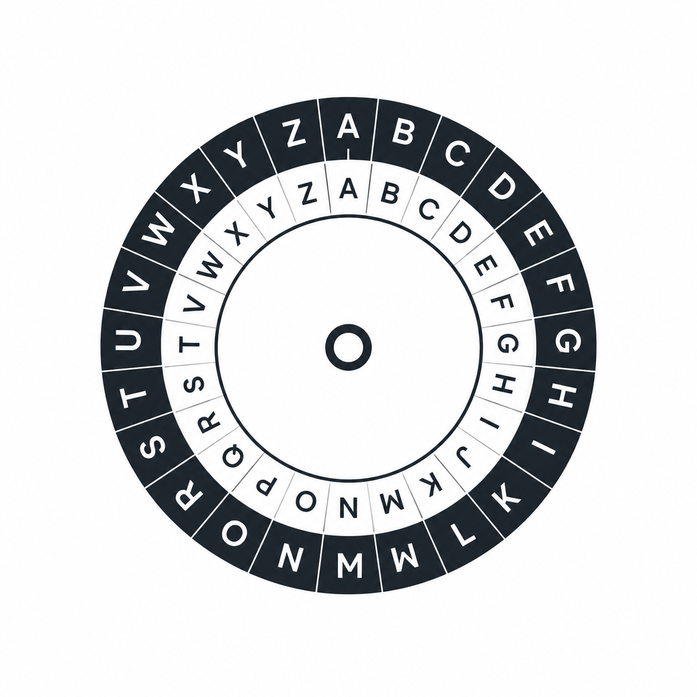

<p align="center">
  
</p>

# cipher

A Go library and CLI for [sops](https://github.com/getsops/sops) that fills
the gap sops itself left open: **programmatic encryption**, key rotation,
recipient management, and a project-wide pre-commit safety net.

Sops ships a stable Go API for **decryption only** (`decrypt.File` /
`decrypt.Data`). Programmatic **encryption** requires assembling a
`sops.Tree`, building `KeyGroups`, picking a `Cipher`, calling internal
helpers under `cmd/sops/common`, and emitting via a per-format store —
the exact ~50 lines of boilerplate that has been copy-pasted from
[issue #1094](https://github.com/getsops/sops/issues/1094) for years.

cipher collapses all of that — and the operations that come after
encryption (rotate, add/remove recipients, walk a directory in parallel,
edit a file in `$EDITOR`, drive everything from `.sops.yaml`) — into a
small set of single-method interfaces with sensible defaults.

```go
enc := cipher.NewEncoder(age.NewProvider("age1qyqsz..."))
ciphertext, err := enc.Encode(ctx, "secrets.yaml", plain)
```

## What it does

| Capability | API |
| ---------- | --- |
| Encrypt/decrypt a single file in memory | `Encoder.Encode`, `Decoder.Decode` |
| Walk a directory tree (sequential or parallel) | `EncodeWalk`, `DecodeWalk`, `RotateWalk` |
| Decrypt → mutate → re-encrypt atomically | `Edit`, `EditWith` |
| Rotate the data key (new ciphertext, same recipients) | `Rotate`, `RotateWalk` |
| Add a recipient without re-encrypting the payload | `AddRecipient` |
| Revoke a recipient | `RemoveRecipient` |
| List recipients/metadata without decrypting | `Inspect`, `InspectPath` |
| Diff recipients across two encrypted versions | `DiffRecipients`, `DiffRecipientsPath` |
| Detect already-encrypted files | `IsEncrypted`, `IsEncryptedPath` |
| Route per-path key selection from `.sops.yaml` | `sopsconfig.Config.Router`, `NewRoutedEncoder` |
| Shamir-threshold rule builder | `NewShamirRule` |
| Backup originals on write | `WalkOptions.BackupSuffix`, `EditOptions.BackupSuffix` |
| Reject plaintext secrets in git | `precommit.Checker`, `cipher precommit` |
| HTTP middleware (decrypt body / encrypt response) | `cipher/httpmw` |
| OpenTelemetry tracing | `cipher/otelcipher` |
| Test helpers (age identity + round-trip assertions) | `cipher/ciphertest` |
| Size guard against oversized inputs | `EncoderOptions.MaxPlaintextBytes` |
| End-to-end CLI | `cmd/cipher` (encrypt / decrypt / edit / rotate / walk / add-recipient / remove-recipient / precommit) |

## Backends

Every backend implements one interface (`KeyProvider`) and lives in its
own subpackage. Compose them, swap them, mix them:

| Backend | Subpackage | Constructor |
| ------- | ---------- | ----------- |
| age | `cipher/age` | `age.NewProvider(recipients...)` |
| AWS KMS | `cipher/kms` | `kms.NewProvider(arns...)` |
| GCP KMS | `cipher/gcpkms` | `gcpkms.NewProvider(resourceIDs...)` |
| HashiCorp Vault Transit | `cipher/vault` | `vault.NewProvider(uris...)` |
| Azure Key Vault | `cipher/azkv` | `azkv.NewProvider(urls...)` |
| GPG / PGP | `cipher/pgp` | `pgp.NewProvider(fingerprints...)` |

Wrap multiple backends in a single key group with `cipher.MergeProviders`,
or use `cipher.ChainKeyProviders` to feed them as separate groups.

## Install

```sh
go get github.com/dcadolph/cipher
go install github.com/dcadolph/cipher/cmd/cipher@latest
```

Requires Go 1.23 or newer.

## Quick start

### Encrypt in memory

```go
ctx := context.Background()
enc := cipher.NewEncoder(age.NewProvider("age1qyqsz..."))
ciphertext, err := enc.Encode(ctx, "secrets.yaml", []byte("foo: bar\n"))
```

### Decrypt in memory

```go
dec := cipher.NewDecoder()
plain, err := dec.Decode(ctx, "secrets.yaml", ciphertext)
```

`Decoder` uses the standard sops identity sources (`SOPS_AGE_KEY`,
`SOPS_AGE_KEY_FILE`, AWS credentials, etc.) — the same env that drives
the `sops` binary works here.

### Walk a directory (with bounded parallelism)

```go
err := cipher.EncodeWalkWith(
    ctx, afero.NewOsFs(), "./secrets",
    cipher.NewEncoder(age.NewProvider(recipient)),
    []cipher.FileMatcher{cipher.MatchExt("yaml", "yml", "json")},
    cipher.WalkOptions{
        Parallelism: 8,
        OnFile: func(p string, n int) { log.Printf("encrypted %s (%d)", p, n) },
        OnSkip: func(p string, reason error) { log.Printf("skip %s: %v", p, reason) },
    },
)
```

Already-encrypted files are skipped. Files are written atomically
(temp + rename) so a failed write never leaves a half-encrypted secret.

### Edit a file in `$EDITOR`

```go
err := cipher.Edit(ctx, afero.NewOsFs(), "secrets.yaml", enc, dec,
    func(plain []byte) ([]byte, error) {
        return append(plain, []byte("new_key: value\n")...), nil
    },
)
```

Read-only `fn`? Return the same bytes — `Edit` skips the write.

### Drive everything from `.sops.yaml`

```go
cfg, _ := sopsconfig.LoadFromDir(".")
router := cfg.Router(nil)
enc := cipher.NewRoutedEncoder(router, cipher.EncoderOptions{})

ciphertext, err := enc.Encode(ctx, "secrets/prod/db.yaml", plain)
```

The Router consults the project's `.sops.yaml` on every call — same
matching semantics as the `sops` CLI's `creation_rules`.

### Rotate the data key

```go
rotated, err := cipher.Rotate(ctx, "secrets.yaml", ciphertext, enc, dec)
```

Same recipients, new data key. Use `RotateWalk` over a directory.

### Add or remove a recipient (no payload re-encryption)

```go
withBob, err := cipher.AddRecipient(
    ctx, "secrets.yaml", ciphertext,
    age.NewProvider("age1bob..."),
    cipher.DecoderOptions{},
)
withoutBob, err := cipher.RemoveRecipient(
    ctx, "secrets.yaml", withBob, "age1bob...",
)
```

Only the wrapped data key changes — the encrypted payload is byte-for-byte
identical.

## Concepts

Four single-method interfaces. Each has a matching `Func` adapter so a
plain function satisfies it (the `http.HandlerFunc` style).

| Interface | Method | Purpose |
| --------- | ------ | ------- |
| `Encoder` | `Encode(ctx, path, data) ([]byte, error)` | Encrypts file bytes. |
| `Decoder` | `Decode(ctx, path, data) ([]byte, error)` | Decrypts file bytes. |
| `KeyProvider` | `KeyGroups(ctx) ([]sops.KeyGroup, error)` | Supplies recipients. |
| `FileMatcher` | `Match(path) bool` | Selects files during a walk. |
| `Router` | `Resolve(path) (KeyProvider, EncoderOptions, error)` | Picks recipients per path. |
| `Logger` | `Debugf / Infof / Warnf` | Optional observability hook. |

Matchers: `MatchAll`, `MatchNone`, `MatchRegex`, `MatchExt`, `MatchGlob`,
`MatchAnyOf`, `MatchAllOf`, `MatchNot`.

Encoder/Decoder options expose every sops knob (`EncryptedRegex`,
`UnencryptedSuffix`, `MACOnlyEncrypted`, `ShamirThreshold`, custom
`KeyServiceClient`, custom `sops.Cipher`) plus a `Logger` and per-call
`OnEncrypt` / `OnDecrypt` callbacks.

## CLI

```
cipher encrypt PATH         # encrypt a file (--age / --kms / --gcp-kms / --vault-uri / --azure-keyvault / --pgp / --config)
cipher decrypt PATH         # decrypt a file
cipher edit PATH            # decrypt → $EDITOR → re-encrypt
cipher rotate PATH...       # rotate the data key
cipher walk encrypt ROOT    # walk a tree, encrypting matches
cipher walk decrypt ROOT
cipher walk rotate ROOT
cipher add-recipient PATH --age AGE1...
cipher remove-recipient PATH RECIPIENT_STRING
cipher precommit            # reject staged plaintext files that .sops.yaml says should be encrypted
cipher version
```

Every command supports `-i/--in-place`, `-o/--output`, and stdin/stdout
via `PATH == "-"`. Walks take `--ext`, `--regex`, and `--parallel`.

### Git pre-commit hook

```bash
#!/usr/bin/env bash
exec cipher precommit
```

Drops into `.git/hooks/pre-commit` (or your `pre-commit` framework).
Walks `git diff --cached`, compares each staged blob against the
project's `.sops.yaml`, and exits non-zero with a list of paths if any
match a creation rule but are not sops-encrypted. The first time a
teammate forgets to encrypt before committing, this saves the day.

## Inspect + diff

Read recipients out of an encrypted file without decrypting it:

```go
info, err := cipher.InspectPath("secrets.yaml", data)
for _, group := range info.Groups {
    for _, r := range group {
        fmt.Println(r.Type, r.Identifier)
    }
}
```

Diff two versions of the same secret (great for PR review):

```go
diff, err := cipher.DiffRecipientsPath("secrets.yaml", before, after)
for _, r := range diff.Added   { fmt.Println("+", r) }
for _, r := range diff.Removed { fmt.Println("-", r) }
```

## Shamir secret sharing

`NewShamirRule(match, threshold, providers...)` wires `threshold`-of-N
recovery across heterogeneous backends:

```go
rule := cipher.NewShamirRule(
    cipher.MatchExt("yaml"), 2,
    age.NewProvider("age1ops..."),
    kms.NewProvider("arn:aws:kms:..."),
    gcpkms.NewProvider("projects/..."),
)
enc := cipher.NewRoutedEncoder(cipher.NewRouter(rule), cipher.EncoderOptions{})
```

## HTTP middleware (`cipher/httpmw`)

```go
http.Handle("/secrets/", httpmw.DecryptRequestBody(
    cipher.NewDecoder(), httpmw.DefaultPathFunc,
)(myHandler))

http.Handle("/export/", httpmw.EncryptResponseBody(
    cipher.NewEncoder(age.NewProvider(recipient)), httpmw.DefaultPathFunc,
)(myHandler))
```

Decryption failures return 400. Oversize bodies return 413
(configurable via `WithMaxBodyBytes`). The wrapped handler sees
plaintext via `r.Body`.

## OpenTelemetry tracing (`cipher/otelcipher`)

```go
tracer := otel.Tracer("my-service")
enc := otelcipher.WrapEncoder(cipher.NewEncoder(kp), tracer)
dec := otelcipher.WrapDecoder(cipher.NewDecoder(), tracer)
```

Each call emits a `cipher.Encode` / `cipher.Decode` span with `path`,
`plaintext_bytes`, and `ciphertext_bytes` attributes. Errors are
recorded on the span.

## Test helpers (`cipher/ciphertest`)

```go
func TestMyHandler(t *testing.T) {
    kp, _ := ciphertest.NewProvider(t)
    enc := cipher.NewEncoder(kp)
    dec := cipher.NewDecoder()
    ciphertest.AssertRoundTrip(t, ctx, enc, dec,
        "secrets.yaml", []byte("foo: bar\n"), "foo: bar")
}
```

`NewProvider` generates a fresh age identity, sets `SOPS_AGE_KEY` in the
process environment, and returns a working `KeyProvider`. Tests that use
it must not call `t.Parallel` (the env is process-global).

## Streaming and large files

Sops loads the entire file into memory before emitting; cipher inherits
that constraint. Set `EncoderOptions.MaxPlaintextBytes` to fail fast on
inputs you know would blow the process budget:

```go
enc := cipher.NewEncoderWith(kp, cipher.EncoderOptions{
    MaxPlaintextBytes: 50 << 20, // 50 MiB
})
```

Streaming binary encrypt is not currently supported (sops's data model
does not split a single file across chunks).

## Status

The public API surface is stable. The `internal/sopsx` package wraps
`github.com/getsops/sops/v3/cmd/sops/common` so a breaking change in
sops internals stays contained to a single file.

The wider package tree:

| Package | Purpose |
| ------- | ------- |
| `cipher` | Core interfaces, walker, ops (Edit/Rotate/Add/Remove/Inspect/Diff), Router, status, errors, Logger. |
| `cipher/age`, `cipher/kms`, `cipher/gcpkms`, `cipher/vault`, `cipher/azkv`, `cipher/pgp` | `KeyProvider` per backend. |
| `cipher/sopsconfig` | Parses `.sops.yaml`, returns a `Router`. |
| `cipher/precommit` | Git pre-commit safety check. |
| `cipher/httpmw` | HTTP middleware (decrypt body / encrypt response). |
| `cipher/otelcipher` | OpenTelemetry span wrappers. |
| `cipher/ciphertest` | Test helpers for code that uses cipher. |
| `cmd/cipher` | End-to-end CLI. |
| `cipher/internal/sopsx` | The only place sops's unstable internals are imported. |
| `cipher/internal/atomic` | Temp-file-and-rename writes. |

## Errors

Sentinel errors for `errors.Is`:

- `ErrEncode`, `ErrDecode` — wrap any encode/decode failure
- `ErrAlreadyEncrypted` — input already carries sops metadata
- `ErrNotEncrypted` — input is plain
- `ErrEmpty` — input has no encryptable branches
- `ErrNoKeyGroups` — encoder has no key groups
- `ErrUnsupportedFormat` — format is not supported
- `ErrNoMatchingRule` — Router could not match the path

Walkers treat `ErrAlreadyEncrypted` (encode) and `ErrNotEncrypted`
(decode) as skip signals, not failures.

## License

See LICENSE.
